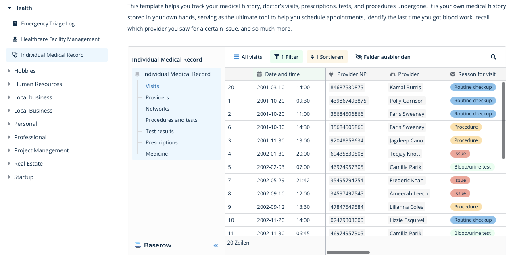

# ETL-UseCases-LeMeDaRT

## Data Modelling

### NoCoDB

Website: https://www.nocodb.com

## Appendix - Alternative Data Tools

### Baserow

Website: https://baserow.io

#### Docker Setup

```
docker run -d --name baserow -e BASEROW_PUBLIC_URL=http://localhost -v baserow_data:/baserow/data -p 80:80 -p 443:443 --restart unless-stopped baserow/baserow:1.14.0

```



